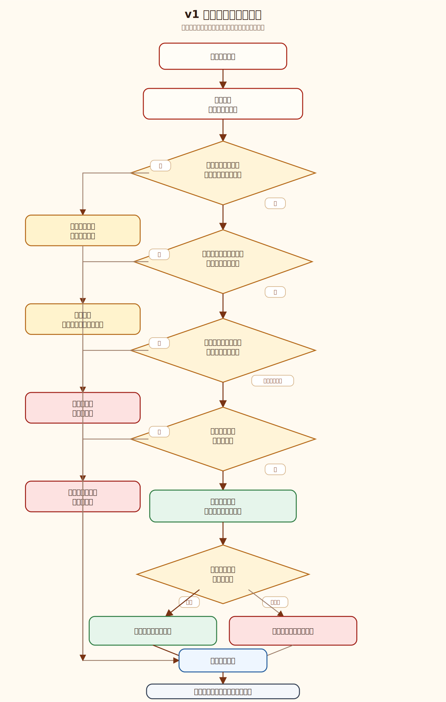
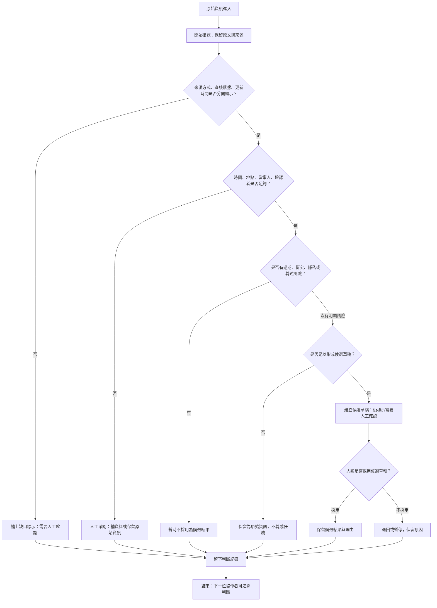

# 資訊流程設計

> 這份流程圖是 v1 前端工作台的設計草稿。流程合理性仍需要人類用 VS Code 預覽 Mermaid 後檢查，不是最終產品規格。

## 我的 v1 目標

- 我優先服務的使用者：資訊整理者。
- 這個使用者最想完成的事：開始確認一筆原始資訊能不能安全進入候選整理流程。
- 我最想避免的錯誤：把未確認資訊、AI 推測或過期資訊顯示成已確認事實，或讓它看起來像可以直接派工。

## 自然語言流程描述

```text
原始資訊進來後，資訊整理者先進入「開始確認」。
整理者先保留原文，並分開查看資訊取得方式、查核狀態與更新時間。
如果來源、時間、地點、當事人或確認者不足，先標示為需要人工確認。
如果資訊有過期、衝突、隱私或非當事人轉述風險，暫時不採用為候選結果。
如果資訊看起來可以形成候選結果，也只能建立候選草稿，不能顯示成已確認。
最後由人類確認是否採用候選草稿；無論採用、退回或暫停，都要留下判斷紀錄。
```

## Mermaid 流程圖





## 人工確認點

- 開始確認時，整理者要確認原文是否有足夠的來源、時間、地點、當事人與確認者資訊。
- 若資訊有過期、衝突、隱私或轉述風險，必須由人判斷是否暫停採用。
- 即使建立候選草稿，也必須由人決定是否採用，不能讓 AI 自動定案。

## 不能自動處理的分支

- AI 不能自動判斷資訊是否為真。
- AI 不能自動補出原文沒有的地點、時間、需求類型、當事人或確認者。
- AI 不能自動決定是否派工、前往現場或提高行動優先順序。
- 有過期、衝突、隱私或非當事人轉述風險時，不能直接轉成候選結果。

## 操作或判斷紀錄

- 標示「需要人工確認」時，要記錄缺少哪些資訊。
- 暫時不採用時，要記錄原因，例如時間未知、衝突、隱私或來源不足。
- 建立候選草稿時，要記錄草稿依據來自原文哪些線索。
- 人類採用或退回候選草稿時，要記錄採用或退回理由。

## 我檢查後修正了什麼

- 原本：流程可能在資訊足夠時直接建立候選結果。
- 修正後：改成先建立「候選草稿」，再經過人類是否採用的判斷。
- 為什麼：避免候選結果看起來像已確認任務，也符合「AI 不能做最後決策」的安全邊界。

## 我仍不確定的流程點

- 「行動可行性」要不要成為獨立欄位，還是只放在候選草稿的提醒中。
- 人類確認者的角色要怎麼標示，才能讓下一位協作者知道誰做過什麼判斷。
- 對於時間未知但來源較完整的資訊，應該先放在人工確認，還是允許形成候選草稿。
